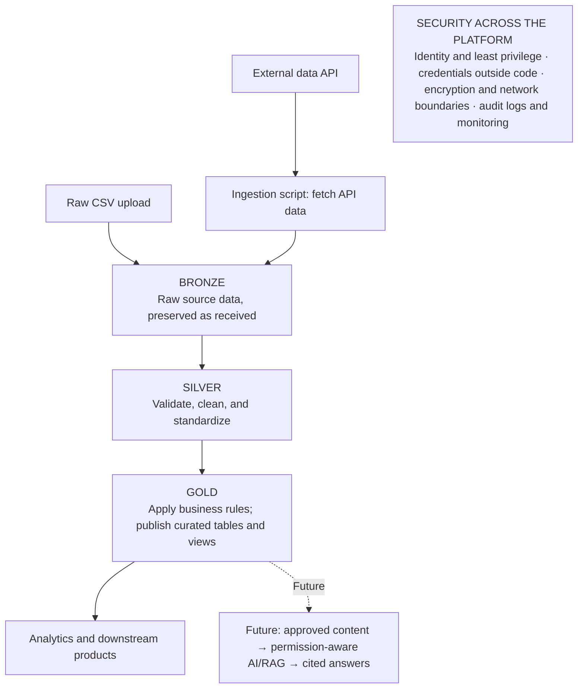

# Initial System Architecture

This initial logical design keeps the data pipeline central. The AI/RAG path is a future consumer; Azure service choices and physical storage layout remain open.

## Design notes

- The ingestion script writes the original API response to Bronze. Raw CSV files can be uploaded directly to Bronze. Retain source and ingestion metadata for traceability.
- Bronze, Silver, and Gold are logical layers. Their physical storage layout and Azure services remain undecided.
- To execute the pipeline in separate Bronze/Silver/Gold scripts. The diagram separates the layers to show how data quality improves from raw input to consumer-ready output.
- To retrieve the credential from a secure store. An Azure-hosted workload can use a managed identity with only the storage permissions it needs.
- Considering using Jupter notebook to execute local implication with Azurite to emulate blob storage (DEV). 
- The dashed AI/RAG path is a future capability using approved data and authorization-aware retrieval.
